# Concurrent Skip-Lists

 

## Introduction

A skip-list is a sorted linked list which contains levels to help speed up the process of searching for a particular value within the list. Skip-list has some advantages and disadvantages compared to other data structures such as linked list or binary tree. Therefore, when working with a lot of data, it is important to identify the most efficient data structure to use. The goals of this project are to understand how skip-list works and how efficient it is when working with such large data sets. In our project, we tested the three main functions of a skip-list, which are insert, contain, and delete using test cases with up to one million elements. These tests were applied for both sequential and concurrent skip-lists. We also compared the performances of  two different concurrent skip-list implementations, fine-grained and lock-free.

 

## The Skip-List Data Structure

A skip-list is constructed with a base level which contain all the value present in the skip-list, certain nodes on the bottom level is promoted to higher levels so that during searching a program is able to first search through the higher levels and once they come to a node whose value is greater than the one they are looking for then they look down a level and continue searching for the value. Figure 1 below presents a general structure of a skip-list.

 

    

**
 Figure 1. Skip-List Structure [1] 
**

Skip-lists take some advantages from both binary tree and linked list data structures. They allow both fast search like binary trees and fine-grained concurrency like linked lists. A detailed comparison between these three data structures is provided in Table 1 below.

**Table 1. Time and Space Complexity of Different Sequential Data structures [2]**

| Operation   | Linked List | Binary Tree   | Skip-List       |
|-------------|-------------|---------------|-----------------|
| Access      | Θ(_n_)      | Θ(_log_(_n_)) | Θ(_log_(_n_))   |
| Search      | Θ(_n_)      | Θ(_log_(_n_)) | Θ(_log_(_n_))   |
| Insert      | Θ(1)        | Θ(_log_(_n_)) | Θ(_log_(_n_))   |
| Delete      | Θ(1)        | Θ(_log_(_n_)) | Θ(_log_(_n_))   |
| Space       | Θ(_n_)      | Θ(_n_)        | Θ(_n log_(_n_)) |

From the Table 1 above, it is clear that between the three data structures, Binary Tree has the best overall time and space complexity, with all operations take Θ(_log_(_n_)) time. Meanwhile, Liked List while having instant time for Insert and Delete, Access and Search would take Θ(_n_). On the other hand, Skip-List has the same time complexity as Binary Tree but requires more space than the other two (Θ(_n log_(_n_)) vs Θ(_n_)).

Things get more complicated in concurrency. With Linked List, fine-grained locking is fast and easy to implement as we only need to lock certain nodes. With Binary Tree, however, we need to lock the whole tree when adding a new node, deleting a node, or changing a node's value. This is because any change to the tree may require it to be re-balanced, which results in a new tree layout. This forces other processes which are also traversing the tree to restart from the tree's root node. Skip-List can avoid this extra step because its operations are similar to Linked List despite having a layered structure. This allow Skip List to performance better than Binary Tree in concurrency.

 

## Implementation

For this project, we used three different skip-list implementations. The first one is a sequential implementation, which was implemented by all team members. The two concurrent skip-list implementations can be found in Chapter 14 of *The Art of Multiprocessor Programming* by Maurice Herlihy and Nir Shavit [3]. At first, we wanted to do our own implementations. However, after consulting with the TA, we decided to use these implementations as they were already optimized, which is better for performance testing purposes.

### Sequential Skip-List

The sequential skip-list is basically built like the description about from the bottom up. Whenever a new node to added to the bottom level of the skip-list a coin is flipped to determine whether to promote that node to a higher level. The node keeps getting promoted to a higher level so long as a coin comes up heads so in a sense a skip-list is not a deterministic algorithm and could have infinite levels but that would never happen because we are using a fair coin.

### Lock-Free Skip-List

The lock-free skip-list is implemented using atomic instructions to update references between nodes at various levels and in between nodes. With a lock-free implementation, each node has properties that track whether it is has been fully inserted into the skip-list or whether it is marked for deletion by other threads. This is to help ensure that when multiple threads are manipulating the skip-list concurrently, they are each aware of that state of a node before they try to do any atomic operations that might relate to that node.

### Fine-Grained Skip-List

The fine-grained implementation of the skip-list is similar to a fine-grained linked list in that every node has a reentrant lock, and for any particular operation, only a small portion of the skip-list is locked at any given moment instead of locking the entire list. The implementation also uses similar variable to the lock-free skip-list to help other threads know whether a node is able to be deleted or if the node has not been fully linked inside the skip-list.

 

## Tests and Results

### Tests

We created multiple test files to test the correctness of all three implementations. After verifying that they all work, we began testing their performances. For this purpose, we created test cases to record the time skip-list would take to add, remove, and search 1,000,000 elements. For each skip-list implementation, we ran these tests three times and recorded the average time. For the two concurrent implementations, we also tested the performances with different number of concurrent threads, ranging from 1 to 512. The results are compared and demonstrated using line graphs, which can be seen in the section below. We also ran these tests on five different computers and on TACC's Stamplede2 server. These devices have CPUs with different frequencies, cores, and threads, which would create more reliable results and make the comparisons more accurate.

### Results

This section contains graphs of the timing of various tests. The x-axis represents number of threads and the y-axis represents the time in milliseconds it took those threads to perform a million operations.

Intel® Core™ Xeon CPU (96 CPUs) | Intel® Core™ i7-8700 CPU @ 3.20GHz (12 CPUs) | Intel® Core™ i7-8550U CPU @ 1.80GHz (8CPUs)
:-------------------------:|:-------------------------:|:-------------------------:
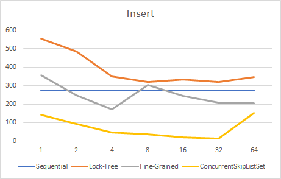 | 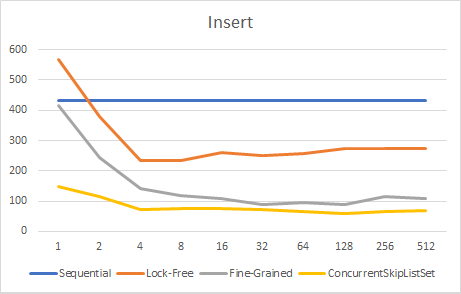 | 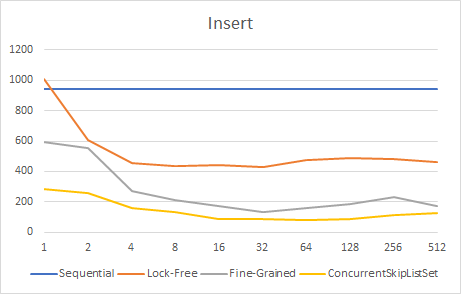
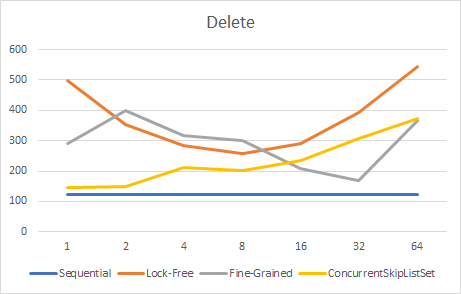 | 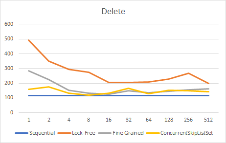 | 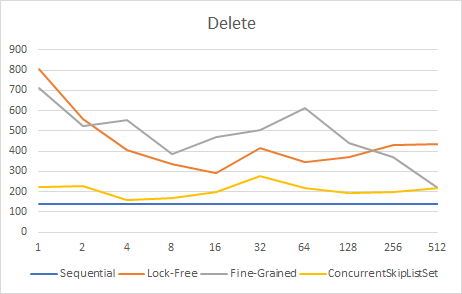
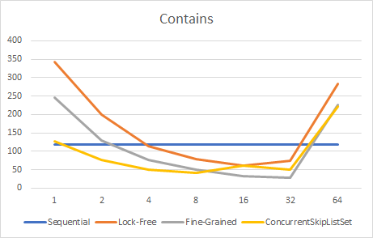 | 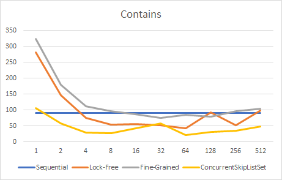 | 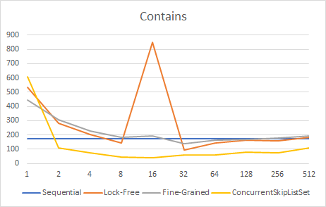

Intel® Core™ i7-9750H CPU @ 2.6GHz (6 CPUs) | Intel® Core™ i5-7200U CPU @ 2.50GHz (4 CPUs) | Intel® Core™ i5-6200U CPU @ 2.30GHz (4CPUs)
:-------------------------:|:-------------------------:|:-------------------------:
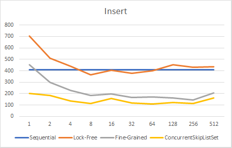 | 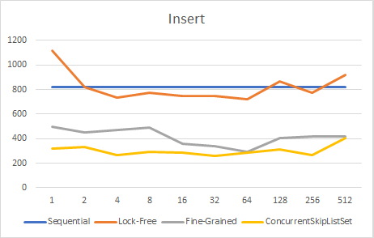 | 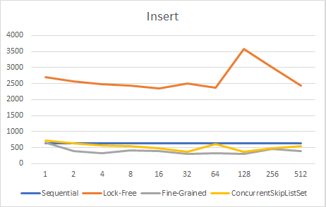
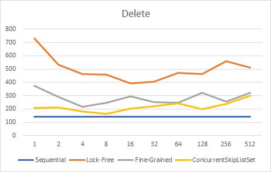 | 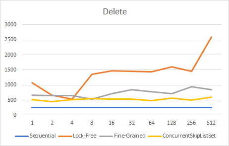 | 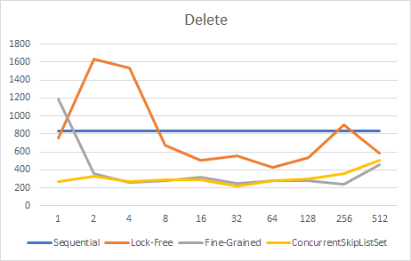
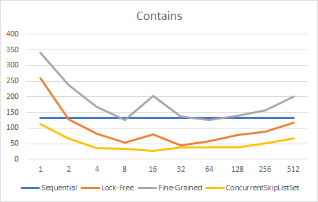 | 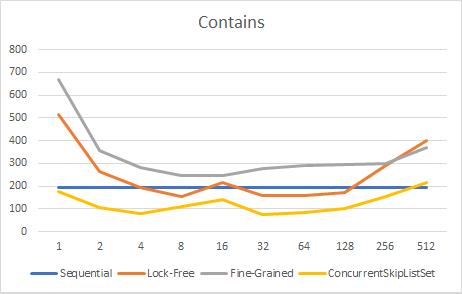 | 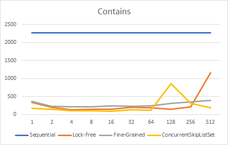

#### Results Summary
Overall, the Java ConcurrentSkipListSet (CSLS) performs the best. On each run of the insert() method, CSLS usually performs the best, followed by the fine-grained, lock-free, and then sequential skip lists. For the delete() method, the sequential skip list performs the best, followed by CSLS, fine-grained, and then lock-free skip lists. For the contains() method, CSLS performs the best, followed by lock-free, sequential, and then fine-grained. Based on all of our runs, on average CSLS performs the best, and all the other implementations perform similar to one another. On most implementations, concurrent skip list implementations usually perform worse with few threads or too many threads. The minimum runtime/peak performance is usually centered between 8 - 64 threads. 
 

## Conclusion
Overall, adding concurrency to skip list improves performance. This is especially noticeable when the peak performance is achieved (between 8-64 threads depending upon CPU). Since iterative skip lists already have much better performance for basic tasks like inserting, deleting, and searching elements than other common data structures, a concurrent skip list is one of the best-performing data structures with respect to runtime complexity. A concurrent implementation allows multiple modifications at the same time while retaining the order log(n) time complexity.

In some of our results, the iterative skip list performs comparably to the lock-free and fine-grained skip lists. This occurs when there are either very few threads or more threads than the CPU has available in hardware. One reason for this performance is that there is significant overhead associated with creating each individual thread, which hurts runtime performance. Additionally, when one core runs multiple threads, it uses context switching to manage each thread. As context switching increases, runtime performance worsens since the CPU spends more cycles executing the context switching instead of executing the skip list functions.  

 

## Instructions for use
The directory ‘concurrent’ holds the SkipList interface, the fine grained concurrent skip list (FineGrainedCSL), the lock free concurrent skip list (LockFreeCSL), and our JUnit tests. The directory ‘iter’ contains the iterative (sequential) skiplist implementation and its respective JUnit tests.

Each SkipList implements the SkipList interface, which has four methods: delete(T elem), insert(T elem), contains(T elem), and size(). To use SkipList, first instantiate a SkipList, and then create the threads that you want to modify the SkipList with. Any number of threads should be able to correctly call the four methods on the instantiated SkipList. Methods delete(T elem) and insert(T elem) return a boolean based on whether or not they successfully performed the operation. The method contains(T elem) returns a boolean based on whether or not the SkipList contains the given element. Size() returns the number of unique elements that the SkipList currently contains.
 

## References

[1]&nbsp;&nbsp;&nbsp;&nbsp;&nbsp;&nbsp;Ticki. (2016, Sep 17). *Skip Lists: Done Right* [Online]. Available: <https://ticki.github.io/blog/skip-lists-done-right/>  

[2]&nbsp;&nbsp;&nbsp;&nbsp;&nbsp;&nbsp;*Big-O Cheat Sheet* [Online]. Available: <https://www.bigocheatsheet.com/>

[3]&nbsp;&nbsp;&nbsp;&nbsp;&nbsp;&nbsp;M. Herlihy and N. Shavit, "Skiplists and Balanced Search," in *The Art of Multiprocessor Programming*. Burlington, MA: Morgan Kauffmann, 2008, ch. 14, pp. 329-349.
